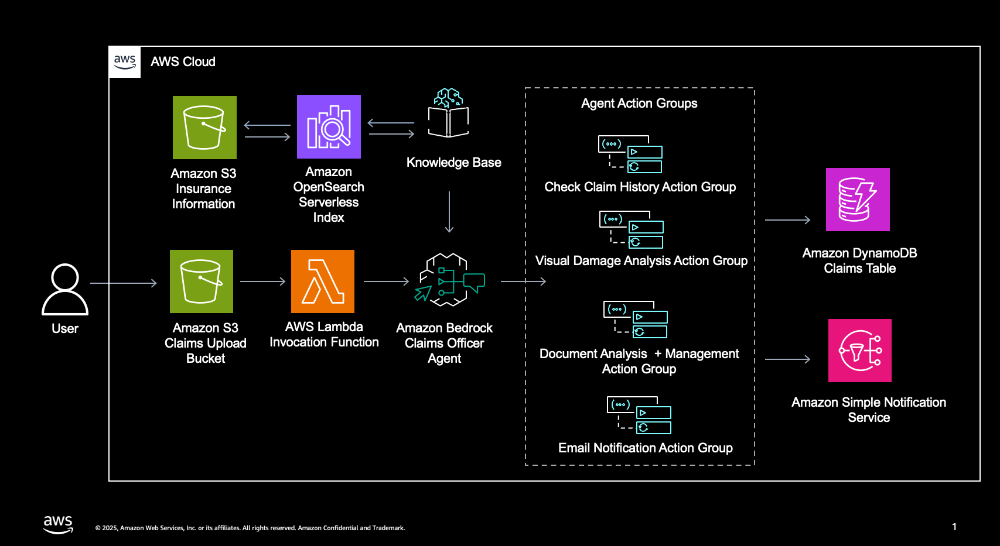

# Multimodal Claims Processing Recommendation System

An AI-powered, serverless auto insurance claims processing system built with AWS CDK, Amazon Bedrock Agent, and Claude 3.7 Sonnet. This system automatically processes vehicle insurance claim documents and damage images, validates auto insurance policies, and makes intelligent approval decisions for automotive claims.

## Features

### **Intelligent Document Processing**
- **Multi-format Support**: Processes PDFs, images (PNG, JPG, JPEG, GIF)
- **AI Document Analysis**: Extracts claim details, policy information, and incident data
- **Image Damage Assessment**: AI-powered vehicle damage analysis with cost estimation
- **Progressive Enhancement**: Each uploaded document enriches the existing claim

### **Business Logic Automation**
- **Policy Validation**: Verifies active policies against knowledge base
- **Timeline Compliance**: Enforces 30-day filing requirements
- **Document Tracking**: Monitors required vs. submitted documents
- **Automated Decisions**: PENDING → APPROVED/DENIED based on business rules

### **Smart Data Management**
- **Claim Versioning**: Complete audit trail of claim evolution
- **Intelligent Merging**: Preserves static data, updates dynamic fields
- **Robust Parsing**: Handles malformed JSON from AI agents
- **Real-time Notifications**: Email alerts via SNS

## Architecture



### **Core Components**
- **AWS CDK**: Infrastructure as Code
- **Amazon Bedrock**: AI Agent orchestration with Anthropic Claude 3.7 Sonnet
- **S3**: Document storage and knowledge base content
- **DynamoDB**: Versioned claim data storage
- **Lambda**: Processing logic and action groups
- **SNS**: Email notifications
- **Knowledge Base**: Policy validation and business rules

## Project Structure

```
multimodal-agentic-claims-processing/
├── claims_processing/
│   └── claims_processing_stack.py          # CDK infrastructure
├── lambda/
│   ├── index.py                       # Main processing function
│   ├── claims_actions.py              # Claim management action group
│   ├── image_analysis.py              # AI image analysis
│   ├── get_claim.py                   # Claim retrieval
│   └── send_notifications.py          # SNS notifications
├── action_groups/
│   ├── create_claims/schema.json      # Claims API schema
│   ├── image_analysis/schema.json     # Image analysis API schema
│   ├── get_claim/schema.json          # Claim retrieval API schema
│   └── notifications/schema.json     # Notifications API schema
├── knowledge-base/
│   ├── claims/                        # Claim processing rules
│   ├── policies/                      # Insurance policy guidelines
│   ├── FAQ/                          # Frequently asked questions
│   └── sample_insurance_policies/     # Sample policy data
├── app.py                            # CDK app entry point
├── requirements.txt                  # Python dependencies
└── README.md
```

## Setup & Deployment

### **Prerequisites**
- AWS CLI configured
- Python 3.9+
- Node.js 18+ (for CDK)
- AWS CDK v2
- Docker

### **Installation**
```bash
## Install Docker through Desktop or CLI if you don't have it already before proceeding ##

# Clone repository
git clone <repository-url>
cd multimodal-agentic-claims-processing

# Create virtual environment
python3 -m venv .venv
source .venv/bin/activate  # On Windows: .venv\Scripts\activate.bat

# Install dependencies
pip install -r requirements.txt

# Install CDK (if not already installed)
npm install -g aws-cdk

# Bootstrap CDK (first time only)
cdk bootstrap
```

### **Deploy**
```bash
# Synthesize CloudFormation template
cdk synth

# Deploy infrastructure
cdk deploy

# Note the output values (bucket names, agent IDs, etc.)
```

## Configuration

To receive email notifications, set your email address using CDK context:

```
$ cdk deploy -c notification_email=your-email@example.com
```

Or add it to `cdk.json`:

```json
{
  "context": {
    "notification_email": "your-email@example.com"
  }
}
```

## Usage

### **Processing Claims**

1. **Upload Initial Claim Form** (PDF)
   - System extracts policy details, incident information
   - Creates new claim with PENDING status
   - Validates policy against knowledge base

2. **Upload Damage Photos** (PNG/JPG)
   - AI analyzes damage severity and affected areas
   - Estimates repair costs from visual assessment
   - Updates claim with damage details

3. **Upload Supporting Documents** (PDF)
   - Repair estimates, police reports, etc.
   - System validates completeness
   - Makes final approval decision

### **Example Workflow**
```
claim_sample1.pdf → Basic claim created (PENDING)
damage_image.png → Damage analysis added (PENDING)  
repair_estimate.pdf → Cost validation (PENDING)
police_report.pdf → Final validation (APPROVED)
```

## Testing

The `sample-claims/` folder contains sample documents for testing the end-to-end claims processing workflow. After deploying the stack, you can:

1. Upload documents from `sample-claims/` to the claims S3 bucket one at a time
2. Monitor the processing through CloudWatch logs
3. Check DynamoDB for processed claim records
4. Verify notifications are sent via SNS

## AI Capabilities

### **Document Analysis**
- **Text Extraction**: Policy numbers, dates, customer information
- **Business Logic**: 30-day filing validation, coverage verification
- **Context Awareness**: References previous documents in analysis

### **Image Analysis**
- **Damage Assessment**: Severity classification (minor/moderate/severe)
- **Cost Estimation**: AI-powered repair cost estimates
- **Area Identification**: Specific vehicle parts affected
- **Visual Context**: Detailed damage descriptions

### **Knowledge Base Integration**
- **Policy Validation**: Real-time policy status checks
- **Coverage Lookup**: Deductibles, coverage types, limits
- **Business Rules**: Automated compliance checking

## Data Structure

### **Claim Record Example**
```json
{
  "claim_id": "CLAIM-2025-001",
  "version": "2025-09-25T06:25:35.250234",
  "status": "APPROVED",
  "claim_details": {
    "policy_number": "AUTO-1234-5678",
    "customer_id": "CUST-001",
    "active_policy": true,
    "incident_date": "2025-09-02",
    "incident_location": "123 Main Street, Boston, MA",
    "damage_description": "Rear-end collision damage...",
    "damage_severity": "medium",
    "estimated_cost_from_image": "$3,000-$5,000",
    "total_repair_cost": "3,559.38"
  },
  "documents": {
    "current_uploaded_documents": [
      "claim_sample1.pdf",
      "damage_image.png", 
      "repair_estimate.pdf",
      "police_report.pdf"
    ],
    "required_documents": [
      "Photo of damage",
      "Repair estimate", 
      "Police report"
    ]
  },
  "version_summary": {
    "claim_status": "APPROVED",
    "document_analysis": "Complete analysis summary...",
    "next_steps": "Payment processing instructions...",
    "remaining_requirements": []
  }
}
```

## Useful commands

 * `cdk ls`          list all stacks in the app
 * `cdk synth`       emits the synthesized CloudFormation template
 * `cdk deploy`      deploy this stack to your default AWS account/region
 * `cdk diff`        compare deployed stack with current state
 * `cdk docs`        open CDK documentation

## Authors

This project was created by **[Harshita Tirumalapudi](https://www.linkedin.com/in/harshita-tir/)** - AWS Partner Solutions Architect

## Security

See [CONTRIBUTING](CONTRIBUTING.md#security-issue-notifications) for more information.

## License

This library is licensed under the MIT-0 License. See the LICENSE file.